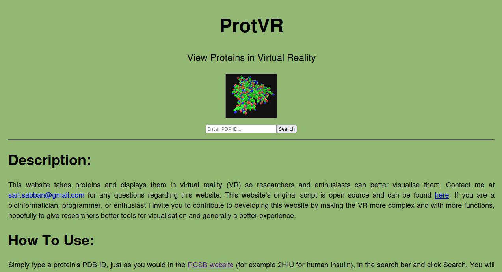

# ProtVR
Visualise a Protein in Virtual Reality

## HISTORY:
I manually coded the HTML front-end part of this website, and the Python back-end, from the ground up for fun. This website was established on 20 March 2017 @ 22:06 GMT+3, and it looked like this at the time it was shutdown on 29 August 2024 @ 16:20 GMT+3 after running non-stop for 7 and a half years.

## DESCRIPTION:
This script does the following converts a PDB (Protein Data Bank) file into a HTML code that can be used to visualise the protein in VR (Virtual Reality).

This script was written to run on GNU/Linux using python 3, it was not tested in Windows or MacOS.
Contact the author at sari.sabban@gmail.com for any questions regarding this script.

## HOW TO USE:
To use follow these steps:

1. To download the protein file from the RCSB (rcsb.org) website and run the script type this command: 
`./ProtVR.py -d FILENAME.pdb `

2. If the protein file is already available in your computer:
  * Place this script and the protein's file (.pdb) in the same folder.
  * In the terminal, navigate to the folder.
  * Run the script type this command: `./ProtVR.py FILENAME.pdb `

3. View your HTML script in http://codepen.io/mozvr/pen/BjygdO

## WEBSITE:
A website is available for ease of use: http://protvr.com. The website is opensource and can be found in the FlaskApp directory.
